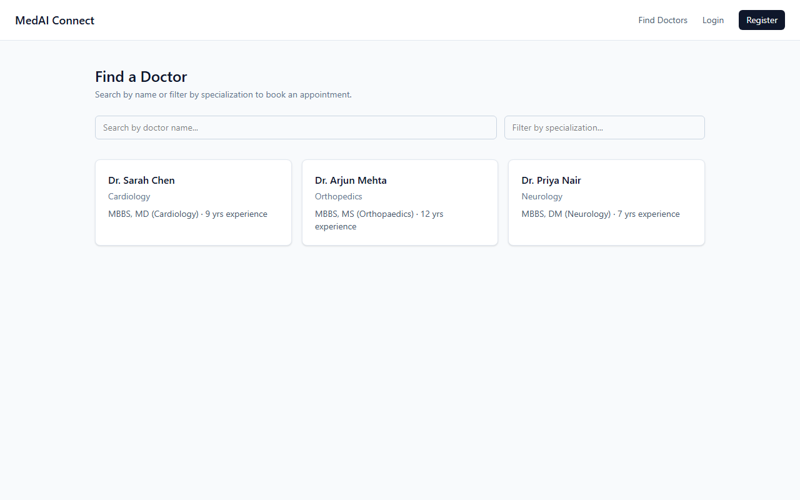
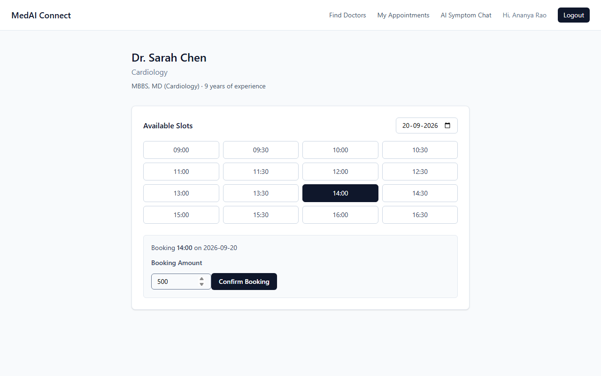
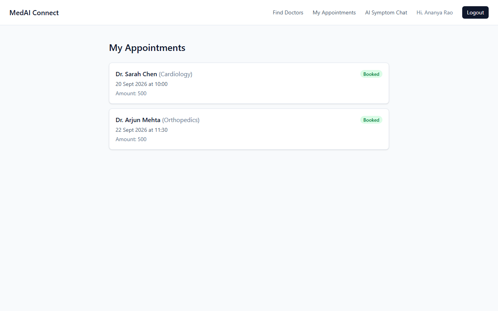
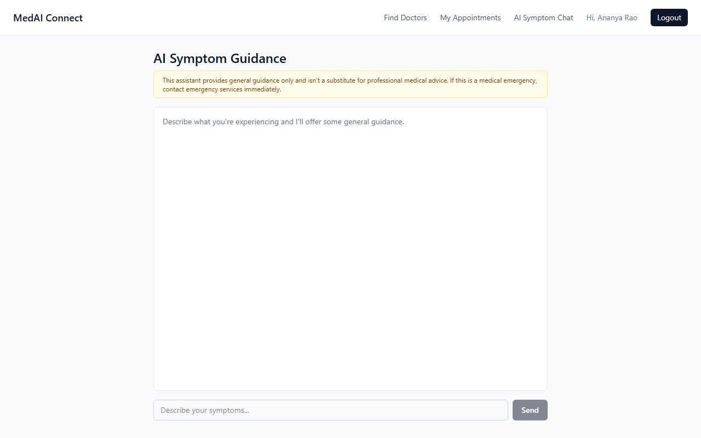
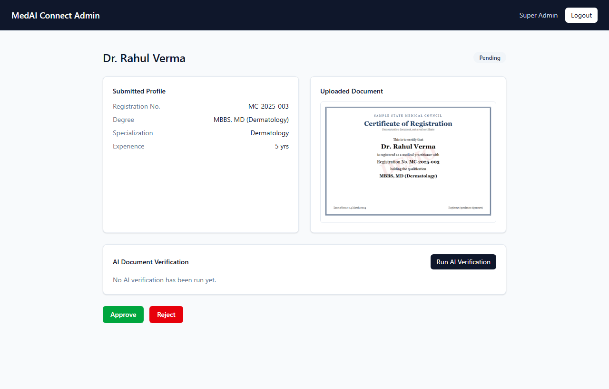
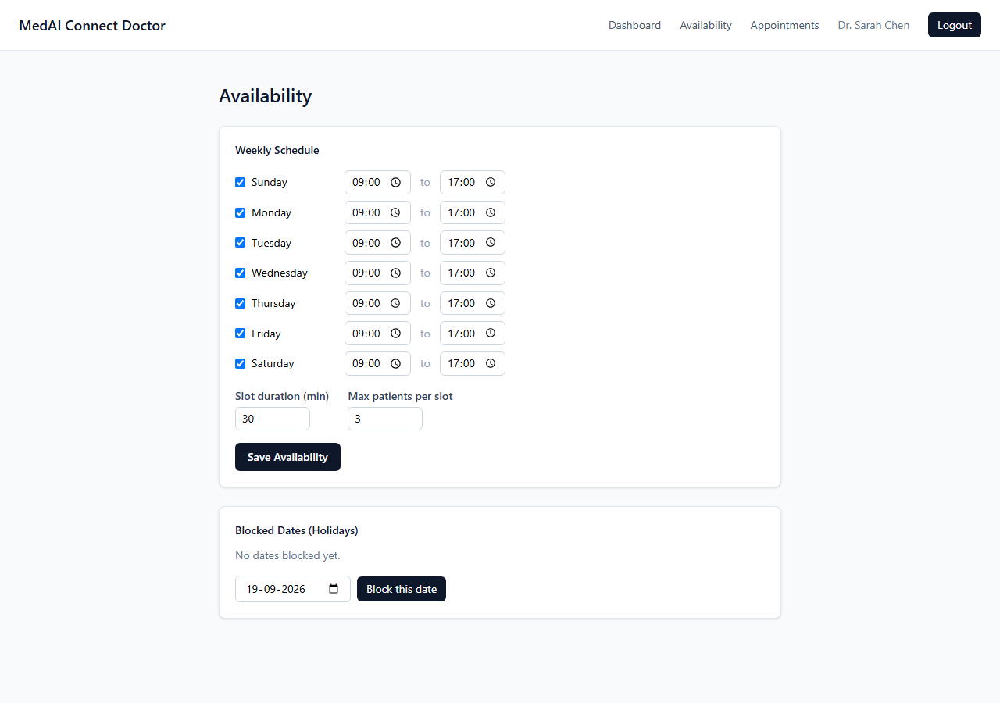
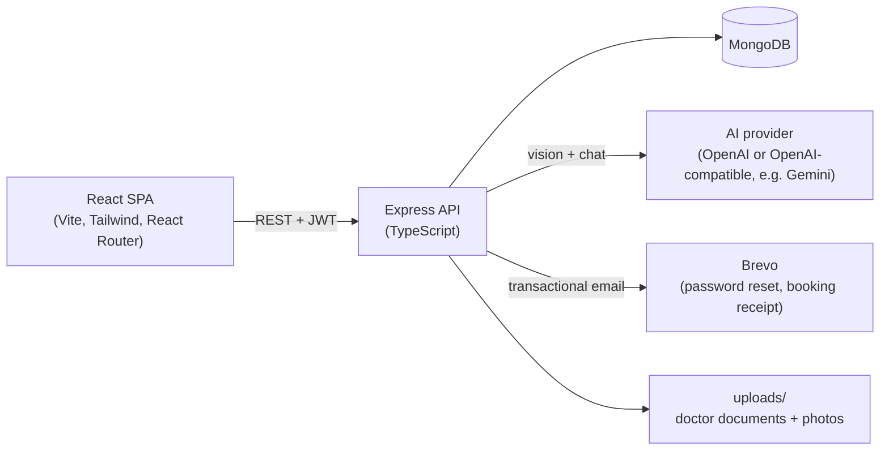

# MedAI Connect

An AI-assisted doctor appointment platform. Patients find a doctor, book a slot and get general symptom guidance from an AI assistant; doctors manage their own schedule; admins verify doctor credentials with the help of an AI document check. Built as a full-stack TypeScript project: **React + Express + MongoDB**, containerised with **Docker**.

## What it does

| Role | Can do |
|---|---|
| **Patient** | Register and log in (email or phone + password, with a forgot/reset-password email flow) · search doctors by name and filter by specialization · view a doctor's profile (photo, bio, degree, experience) and open slots (next 30 days) · book an appointment and get an email receipt · view booking history · cancel a booking up to 48 hours before it starts · chat with an AI symptom-guidance assistant |
| **Doctor** | Self-register in the UI with a registration certificate (starts as *Pending*) · log in with the generated Login ID once approved · view profile · set a profile photo and bio for patients to see · set a weekly availability template (slot length, patients per slot) · block holiday dates · activate the profile so patients can book · view their appointments |
| **Admin** | Log in · work through the queue of pending doctors · view the uploaded certificate · run an on-demand **AI document check** · approve or reject |

### The two AI features

1. **AI document verification (admin).** A vision-capable model reads the certificate a doctor uploaded and extracts their name, registration number and degree, then compares each to what the doctor typed into the registration form, returning *match / mismatch / uncertain* per field plus any concerns and a plain-language summary (structured JSON output). It is triggered on demand by the admin, it **never approves or rejects anything itself**: a human always makes the final call. Unsupported files (e.g. PDF) and API failures degrade to a clear "Failed" state instead of crashing the review flow.
2. **Symptom-guidance chat (patient).** One ongoing conversation per patient, stored in MongoDB. The system prompt restricts the assistant to general, triage-level guidance: no diagnoses, no medication or dosage advice, explicit emergency-escalation wording for red-flag symptoms, and it steers the patient toward booking a real doctor. The UI shows a permanent disclaimer. Only the last 20 messages are sent to the model, messages are capped at 1,000 characters, and a failed AI call persists nothing.

> Both features need an AI provider key. Without one the rest of the app works normally and the AI features return a clean error. OpenAI works, but so does **Google Gemini's free tier** (no credit card) - the client just talks to any OpenAI-API-compatible endpoint. See [Setup & Run Guide](docs/06-Setup-and-Run-Guide.md#4-ai-provider-key).

## Screenshots

| Patient: find a doctor | Patient: pick a slot and book |
|---|---|
|  |  |

| Patient: booking history | Patient: AI symptom chat |
|---|---|
|  |  |

| Admin: review a pending doctor | Doctor: weekly availability |
|---|---|
|  |  |

*All data shown is fictional. The certificate in the admin view is a generated demo document, not a real one.*

## Engineering highlights

- **Concurrency-safe everywhere it matters.** Booking (`bookedCount < maxPatients` + `$inc`), admin approve/reject, cancellation, and first-time chat/availability saves are all atomic conditional updates, not check-then-write. Verified by firing simultaneous requests at each: exactly one succeeds, the other gets a clean `409`. If a later step fails after a seat/slot is claimed, it's released again.
- **Role-based JWT auth** for three roles with composable `verifyToken` / `requireRole` middleware, deliberately vague login errors, bcrypt hashing, and cryptographically secure credential generation. The server refuses to start at all if `JWT_SECRET` is unset, rather than silently signing tokens against an empty string.
- **Human-in-the-loop AI.** AI output is advice to a person (admin / patient), never an autonomous decision.
- **Reviewed by an automated code-review bot.** Every PR runs the Claude Code review action. It caught real bugs that were then fixed, including plaintext passwords in debug logs, a `NaN` amount bypassing validation, a negative slot duration causing an infinite loop, and a path-traversal risk in uploaded-document filenames. The findings are written up in the [Development Log](docs/03-Development-Log.md).
- **Session recovery.** An expired or invalid token doesn't leave a user stuck on a broken page — any `401` clears that role's stored session and redirects to its login page automatically.

## Architecture



| Layer | Technology |
|---|---|
| Frontend | React 19, TypeScript, Vite, Tailwind CSS v4, React Router |
| Backend | Node.js 24, Express 5, TypeScript, Mongoose |
| Database | MongoDB 7 |
| AI | OpenAI API, or any OpenAI-compatible provider (vision model + text chat model) - e.g. Google Gemini's free tier |
| Email | Brevo transactional API (password reset, booking receipt) - free tier, no card |
| Auth | JWT (8h), bcryptjs, fail-fast if `JWT_SECRET` is unset |
| Uploads | Multer (disk storage): doctor documents (admin-gated, 5 MB, PDF/JPG/PNG) and doctor photos (public, static-served, 2 MB, JPG/PNG) |
| Tooling | Docker Compose, GitHub Actions (Claude Code review) |

More detail: [Architecture](docs/04-Architecture.md).

## Quick start (Docker)

**Prerequisites:** [Docker Desktop](https://www.docker.com/products/docker-desktop/) (with Compose v2) and Git.

```bash
git clone https://github.com/SouradeepMisra/MedAI-Connect.git
cd MedAI-Connect

# 1. Create the backend env file (docker compose refuses to start without it)
cp backend/.env.example backend/.env          # PowerShell: Copy-Item backend\.env.example backend\.env
#    then open backend/.env and set JWT_SECRET (required - the server refuses to start without it),
#    OPENAI_API_KEY for the AI features, and BREVO_API_KEY for password-reset/booking-receipt emails (all optional)

# 2. Build and start MongoDB + backend + frontend
docker compose up --build
```

In a second terminal, create the admin account (one-off):

```bash
docker compose exec backend npx ts-node src/scripts/seedAdmin.ts
```

| Service | URL |
|---|---|
| Frontend (patient site) | http://localhost:5173 |
| Doctor portal | http://localhost:5173/doctor/login |
| Admin portal | http://localhost:5173/admin/login |
| API health check | http://localhost:5000/api/health |

The seeded admin is `admin@medai.com` / `ChangeThisPassword123`. This is a **development-only default; change it before exposing the app anywhere**.

Full instructions (running without Docker, environment variables, troubleshooting): [Setup & Run Guide](docs/06-Setup-and-Run-Guide.md).

## Try the whole flow in ~5 minutes

1. **Doctor** self-registers at `/doctor/register` with a certificate upload. Status becomes *Pending*.
2. **Admin** logs in at `/admin/login`, opens the pending doctor, views the certificate, optionally runs the AI check, and clicks **Approve**.
3. **Doctor** logs in with the generated Login ID, sets availability, optionally adds a photo and bio under **Edit Profile**, and clicks **Activate**.
4. **Patient** registers at `/register`, searches for the doctor, picks a date and slot, and books — a confirmation email arrives if `BREVO_API_KEY` is configured.
5. **Doctor** sees the booking under *Appointments*; **patient** sees it under *My Appointments* (and can cancel it, more than 48 hours ahead of the slot), and can try the *AI Symptom Chat*.

Step-by-step with screens and copy-paste `curl` commands: [End-to-End Walkthrough](docs/07-End-to-End-Walkthrough.md).

## Project structure

```
MedAI-Connect/
├── backend/            Express + TypeScript API
│   └── src/
│       ├── models/        Mongoose schemas (Patient, Doctor, Admin, DoctorAvailability, Slot, Appointment, ChatLog)
│       ├── routes/        HTTP routes per role/feature
│       ├── middleware/    JWT verification, role checks, file upload (documents + photos)
│       ├── services/      AI-backed logic (document verification, symptom chat) and transactional email
│       ├── utils/         slot generation, atomic booking, credential generation, JWT secret, AI provider client
│       └── scripts/       one-off scripts (seedAdmin, seedDoctors)
├── frontend/           React + Vite + Tailwind SPA
│   └── src/
│       ├── api/           typed fetch client + per-domain API modules
│       ├── context/       auth contexts (patient, doctor, admin)
│       ├── components/    navbars, protected routes, cards
│       └── pages/         patient pages, plus admin/ and doctor/ areas
├── docker/             Dockerfiles for backend and frontend
├── docker-compose.yml  MongoDB + backend + frontend
├── docs/               vision, PRD, architecture, API reference, guides, dev log
└── .github/workflows/  automated Claude Code PR review
```

## Documentation

| Doc | What's in it |
|---|---|
| [01 Project Vision](docs/01-Project-Vision.md) | Problem, users, goals, what shipped |
| [02 Product Requirements](docs/02-Product-Requirement-Document.md) | Original requirements + implementation status of each |
| [03 Development Log](docs/03-Development-Log.md) | Decisions, trade-offs, bugs and lessons, in order |
| [04 Architecture](docs/04-Architecture.md) | Components, data model, key request flows |
| [05 API Reference](docs/05-API-Reference.md) | Every endpoint, auth requirement, request/response |
| [06 Setup & Run Guide](docs/06-Setup-and-Run-Guide.md) | Docker and non-Docker setup, env vars, troubleshooting |
| [07 End-to-End Walkthrough](docs/07-End-to-End-Walkthrough.md) | The full flow across all three roles |
| [08 Project Milestones](docs/08-Meeting-Notes.md) | Dated log of what was delivered, by PR |

## Testing status

There is **no automated test suite yet**. Every feature was verified by hand (API calls with `curl`, plus headless-browser runs with Playwright against the live stack, including a concurrent-booking race check). The repo contains two placeholder smoke tests only, and the frontend one currently fails (a CommonJS/ESM mismatch inherited from the scaffold). Real backend integration tests and a small end-to-end suite are the top item on the roadmap.

## Known limitations & roadmap

- Reschedule appointments (cancel with the PRD's 48-hour rule is done; rebooking today means cancel + book again)
- Patient OTP login (password login, plus email-based forgot/reset password, both work)
- Admin: an "all doctors" page (currently only *pending* doctors are listable in the UI — an already-approved doctor's Login ID must be looked up directly in MongoDB if forgotten), view all users, manage/delete appointments on a doctor's emergency request, reports
- Doctor: clinic notifications; unblocking a holiday; the "current month locked, ask admin" rule
- Real payment gateway (booking currently validates a minimum amount only; cancellation has no refund logic as a result)
- Cancellation doesn't send an email (booking does); a doctor-notified-of-cancellation flow doesn't exist
- Uploaded doctor documents and photos are stored on local disk, so a deployment needs a persistent volume or object storage
- Rate limiting on the AI and email endpoints before any public deployment
- Production build/deploy pipeline (containers currently run dev servers)

## Contributing

Branches are `feature/<scope>` (or `docs/<scope>`), commits follow [Conventional Commits](https://www.conventionalcommits.org/), and everything lands through a pull request. See [CONTRIBUTING.md](CONTRIBUTING.md).

## License

[MIT](LICENSE)
