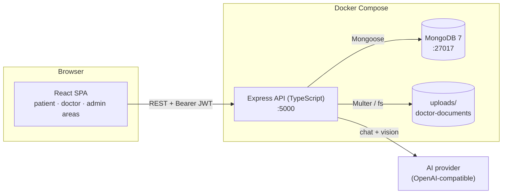
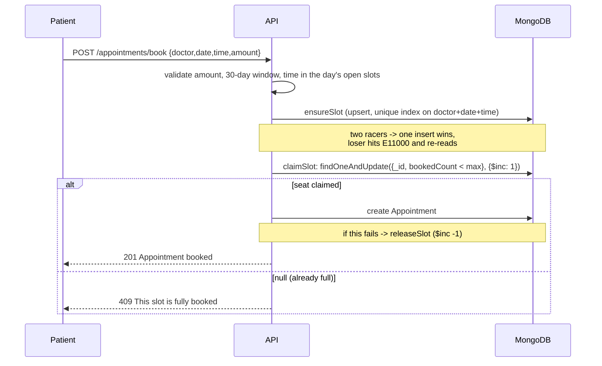
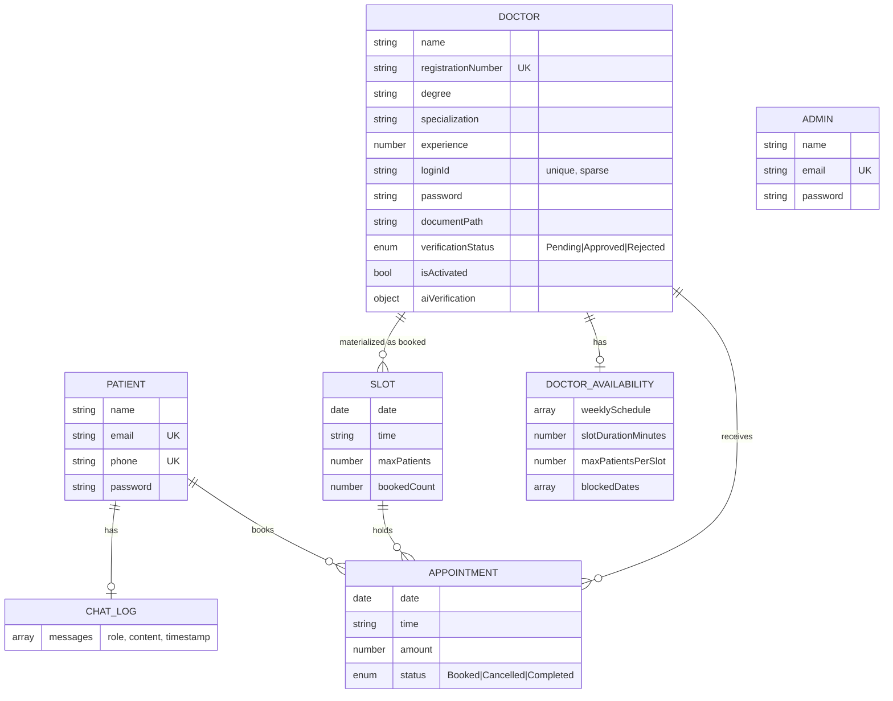

Document Name : Architecture
Version       : 1.0
Author        : Souradeep Misra
Status        : Living document
Created Date  : 20 September 2026
Last Updated  : 20 September 2026

# Architecture

How MedAI Connect is put together and why. The *decision history* (what was tried, what broke) is in the [Development Log](03-Development-Log.md); this document describes the system as it stands.

## 1. System overview

Three services run under Docker Compose (`mongodb`, `backend`, `frontend`), all with bind-mounted source for hot reload. The browser talks directly to the API (CORS restricted to `FRONTEND_URL`); there is no reverse proxy or server-side rendering.

## 2. Backend

Express 5 + TypeScript, organised by responsibility:

| Folder | Role |
|---|---|
| `routes/` | HTTP handlers, one file per role/feature: `patientRoutes`, `doctorRoutes` (public registration and discovery), `authRoutes`, `adminRoutes`, `doctorAvailabilityRoutes` (doctor self-service, mounted at `/api/doctor`), `appointmentRoutes`, `chatRoutes` |
| `models/` | Mongoose schemas (section 4) |
| `middleware/` | `verifyToken` (JWT → `req.user`), `requireRole(role)`, Multer upload config |
| `services/` | Logic that talks to the AI provider: `aiVerificationService`, `symptomChatService` |
| `utils/` | `slotGenerator` (times from a schedule), `slotBooking` (atomic claim/release), `credentialGenerator` (secure IDs/passwords), `openaiClient` (lazy singleton) |
| `scripts/` | `seedAdmin.ts` |

Protection is applied once per router where the whole router is one role (`router.use(verifyToken, requireRole('admin'))`), and per route where a router mixes public and protected endpoints (`appointmentRoutes`).

### Authentication and authorization
Login verifies a bcrypt hash and signs a JWT `{ id, role }` (8h). Failures return deliberately vague messages so they don't reveal whether an account exists. `requireRole` checks the role embedded in the token; there are three independent login flows (patient by email/phone, doctor by generated Login ID, admin by email).

### The booking algorithm (the interesting part)
The doctor's availability is a **template** (weekday → start/end, slot length, patients per slot), not pre-generated slots. A `Slot` document is created lazily, the first time a specific doctor+date+time is booked, then seats are claimed atomically:

The check and the increment are one atomic database operation, so there is no window between "is there room?" and "take a seat". This was verified by firing two simultaneous requests at one open seat: exactly one `201`, one `409`. Slot capacity is copied onto the slot when it is created, so later edits to a doctor's template don't retroactively change existing slots.

### AI features
Both use one lazily-created client (created on first use, not at import, so a missing key can't crash server start-up). It talks to the real OpenAI API by default; an optional `OPENAI_BASE_URL` points it at any other OpenAI-compatible endpoint instead (e.g. Google Gemini's free tier) with no code change in either service - they only deal in configurable model names.

- **Document verification** (`aiVerificationService`): reads the stored JPG/PNG, sends it as a base64 image plus the doctor's submitted name/registration number/degree, and requests **structured JSON output** (a strict schema) so the result is always parseable. Any failure is returned as a `Failed` result rather than thrown. It is triggered on demand by an admin and only records advice on the doctor; approval stays manual.
- **Symptom chat** (`symptomChatService`): a fixed safety-oriented system prompt + the last 20 messages + the new one. The route saves both turns only after the model answers.

### File uploads
Multer stores the certificate on local disk (`backend/uploads/doctor-documents/`, 5 MB, PDF/JPG/PNG). The folder is not served statically: the only way to read a document is the admin-only `GET /api/admin/doctors/:id/document`.

## 3. Frontend

React 19 + TypeScript + Vite, styled with Tailwind v4, routed with React Router.

- **Three areas, one app.** `App.tsx` uses *layout routes* so the patient area (`/`), admin area (`/admin/*`) and doctor area (`/doctor/*`) each get their own navbar and their own protected-route wrapper.
- **Three parallel auth contexts** (`AuthContext`, `AdminAuthContext`, `DoctorAuthContext`), each persisting `{ token, user }` to its own `localStorage` key, so sessions for different roles can coexist without interfering.
- **One fetch wrapper** (`api/client.ts`) attaches the JWT, parses JSON and turns the backend's `{ error }` into a thrown `Error`; each domain has a small typed module (`auth`, `doctors`, `appointments`, `chat`, `admin`, `doctor`). No data-fetching or global-state library: the app is small enough that `fetch` + hooks + context is enough.
- **Authenticated images.** A plain `` can't send an `Authorization` header, so the admin page fetches the certificate as a blob and displays it via `URL.createObjectURL`, revoking the URL on unmount.

## 4. Data model

Design rules used (from the Development Log): **embed** data that is always read as a whole and never grows unbounded (chat messages, the AI result on the doctor); **reference** data queried from several sides or that grows forever (appointments, slots). `Slot` has a unique compound index on `(doctor, date, time)`; `Doctor.loginId` is unique **and sparse** so many pending doctors can exist without one.

## 5. Security posture

| Concern | What's in place |
|---|---|
| Passwords | bcrypt hashes; never returned or logged |
| Credential generation | Node `crypto`, not `Math.random` |
| Access control | JWT + role check on every non-public route; admin-only document access |
| Login errors | Deliberately vague ("Invalid credentials") |
| Input validation | Required fields, numeric/range checks on amounts and durations, 1000-char chat cap, upload type and size limits |
| CORS | Single allowed origin from `FRONTEND_URL` |
| AI safety | Non-diagnostic system prompt, UI disclaimer, human decides doctor approval |
| Secrets | `.env` gitignored and never committed; `.env.example` documents keys |

Known gaps (also in the README roadmap): no rate limiting (matters most for the AI endpoints on a public deployment), the seeded admin password is a dev default, uploads live on local disk, and the containers run development servers rather than a hardened production build.

## 6. Configuration

All runtime configuration is environment variables (`backend/.env`, optional `frontend/.env`), listed with defaults in the [Setup & Run Guide](06-Setup-and-Run-Guide.md#3-environment-variables).
