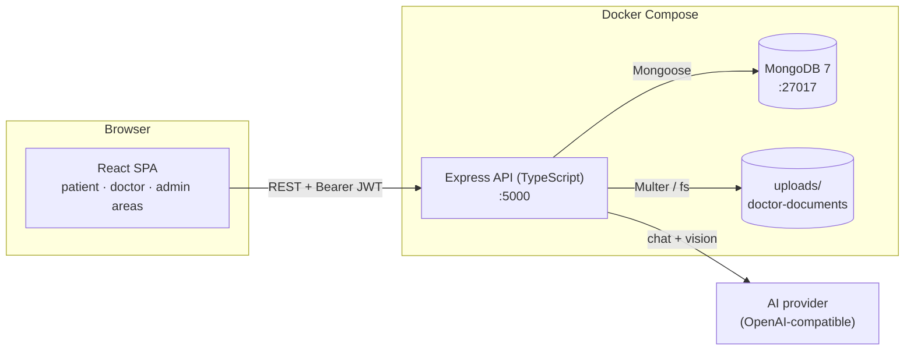
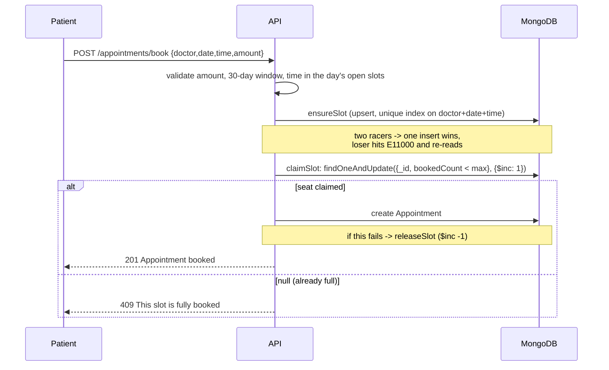
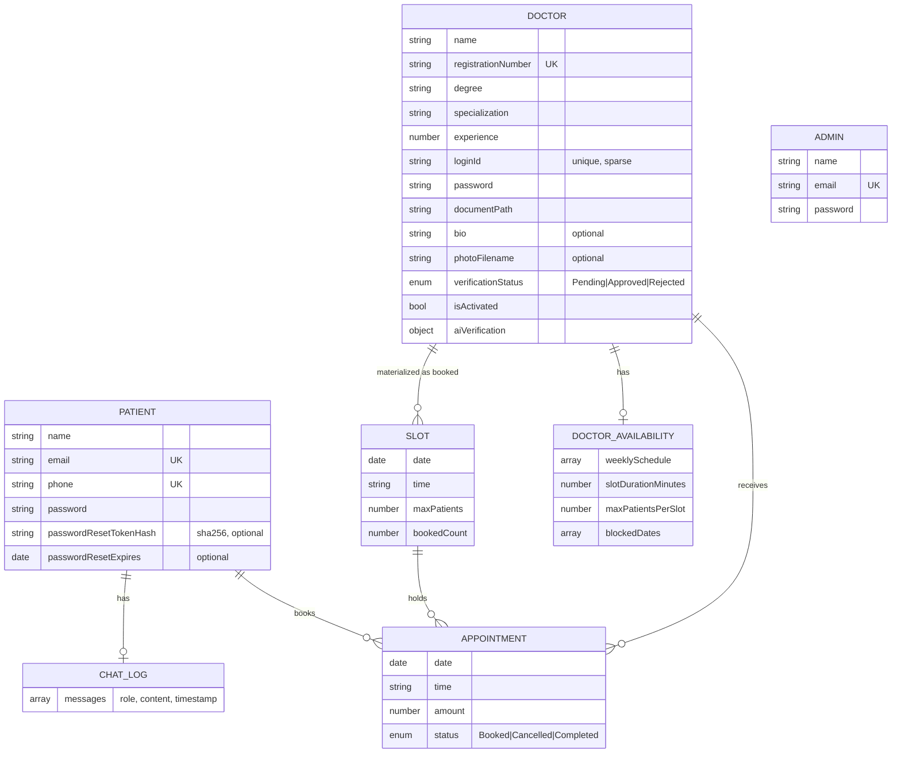

Document Name : Architecture
Version       : 1.1
Author        : Souradeep Misra
Status        : Living document
Created Date  : 20 September 2026
Last Updated  : 5 October 2026

# Architecture

How MedAI Connect is put together and why. The *decision history* (what was tried, what broke) is in the [Development Log](03-Development-Log.md); this document describes the system as it stands.

## 1. System overview

Three services run under Docker Compose (`mongodb`, `backend`, `frontend`), all with bind-mounted source for hot reload. The browser talks directly to the API (CORS restricted to `FRONTEND_URL`); there is no reverse proxy or server-side rendering.

## 2. Backend

Express 5 + TypeScript, organised by responsibility:

| Folder | Role |
|---|---|
| `routes/` | HTTP handlers, one file per role/feature: `patientRoutes`, `doctorRoutes` (public registration and discovery), `authRoutes` (login + forgot/reset password), `adminRoutes`, `doctorAvailabilityRoutes` (doctor self-service, mounted at `/api/doctor`, includes the profile photo/bio update), `appointmentRoutes` (booking + cancellation), `chatRoutes` |
| `models/` | Mongoose schemas (section 4) |
| `middleware/` | `verifyToken` (JWT → `req.user`), `requireRole(role)`, Multer upload config (documents and, separately, photos) |
| `services/` | Logic that talks to external providers: `aiVerificationService`, `symptomChatService`, `emailService` (Brevo) |
| `utils/` | `slotGenerator` (times from a schedule), `slotBooking` (atomic claim/release), `credentialGenerator` (secure IDs/passwords), `jwtSecret` (fail-fast read of `JWT_SECRET`), `openaiClient` (lazy singleton) |
| `scripts/` | `seedAdmin.ts`, `seedDoctors.ts` (demo data across ~20 specializations) |

Protection is applied once per router where the whole router is one role (`router.use(verifyToken, requireRole('admin'))`), and per route where a router mixes public and protected endpoints (`appointmentRoutes`).

### Authentication and authorization
Login verifies a bcrypt hash and signs a JWT `{ id, role }` (8h) using `getJwtSecret()`, which throws if `JWT_SECRET` is unset — called once at startup, so the process exits immediately rather than silently signing every token against an empty-string secret (a full auth bypass). Failures return deliberately vague messages so they don't reveal whether an account exists. `requireRole` checks the role embedded in the token; there are three independent login flows (patient by email/phone, doctor by generated Login ID, admin by email).

A patient can also reset a forgotten password by email: `POST /api/auth/patient/forgot-password` always returns the same generic response regardless of whether the email matches an account (no user enumeration), and only emails a token when it does. The token itself is never stored — only its sha256 hash plus a 1-hour expiry — mirroring the bcrypt-password approach of never persisting a secret in recoverable form. The token is single-use, cleared on a successful `POST /api/auth/patient/reset-password`.

### The booking algorithm (the interesting part)
The doctor's availability is a **template** (weekday → start/end, slot length, patients per slot), not pre-generated slots. A `Slot` document is created lazily, the first time a specific doctor+date+time is booked, then seats are claimed atomically:

The check and the increment are one atomic database operation, so there is no window between "is there room?" and "take a seat". This was verified by firing two simultaneous requests at one open seat: exactly one `201`, one `409`. Slot capacity is copied onto the slot when it is created, so later edits to a doctor's template don't retroactively change existing slots.

**Cancellation** (`PATCH /api/appointments/:id/cancel`, patient-only) is the mirror image: a 48-hour check (the appointment's stored date combined with its `HH:mm` time, compared to now — which also naturally rejects an appointment already in the past), then the same atomic-conditional-update pattern used for admin approve/reject (`findOneAndUpdate` matching `status: 'Booked'`, so a concurrent double-cancel can't both succeed), then `releaseSlot` gives the seat back.

### AI features
Both use one lazily-created client (created on first use, not at import, so a missing key can't crash server start-up). It talks to the real OpenAI API by default; an optional `OPENAI_BASE_URL` points it at any other OpenAI-compatible endpoint instead (e.g. Google Gemini's free tier) with no code change in either service - they only deal in configurable model names.

- **Document verification** (`aiVerificationService`): reads the stored JPG/PNG, sends it as a base64 image plus the doctor's submitted name/registration number/degree, and requests **structured JSON output** (a strict schema) so the result is always parseable. Any failure is returned as a `Failed` result rather than thrown. It is triggered on demand by an admin and only records advice on the doctor; approval stays manual.
- **Symptom chat** (`symptomChatService`): a fixed safety-oriented system prompt + the last 20 messages + the new one. The route saves both turns only after the model answers.

### File uploads
Two separate Multer configurations, deliberately not shared, because they have different access models:
- **Documents** (`backend/uploads/doctor-documents/`, 5 MB, PDF/JPG/PNG) are sensitive registration certificates. The folder is not served statically; the only way to read one is the admin-only `GET /api/admin/doctors/:id/document`.
- **Photos** (`backend/uploads/doctor-photos/`, 2 MB, JPG/PNG) are meant to be public, so they're served directly via `express.static`. A doctor replacing their photo best-effort-deletes the old file.

Both generate the stored filename from a validated mimetype plus `crypto.randomBytes`, never from the client-supplied filename — closes path traversal via a crafted name (e.g. `../../../etc/x.pdf`).

### Email
`emailService.ts` wraps Brevo's transactional email API behind one shared `sendEmail()` helper, used by both the password-reset email and the booking-confirmation receipt. The two calls differ in how a failure is treated: a reset email *is* the point of that request, so a failure is a real error returned to the client; a booking receipt is a courtesy copy sent after the booking has already fully succeeded, so its failure is only logged, never surfaced.

## 3. Frontend

React 19 + TypeScript + Vite, styled with Tailwind v4, routed with React Router.

- **Three areas, one app.** `App.tsx` uses *layout routes* so the patient area (`/`), admin area (`/admin/*`) and doctor area (`/doctor/*`) each get their own navbar and their own protected-route wrapper.
- **One auth-context factory, three instances.** `AuthContext`, `AdminAuthContext` and `DoctorAuthContext` were three ~60-line copies of the same create-context/localStorage-sync/login/logout logic; now built from one `createAuthContext<TUser>(storageKey)` in `context/createAuthContext.tsx`, each a thin adapter renaming the generic `user` field to its domain name (`patient`/`admin`/`doctor`). Each still persists to its own `localStorage` key, so sessions for different roles coexist without interfering; no public API (hook names, returned fields) changed when this was extracted.
- **One fetch wrapper** (`api/client.ts`) attaches the JWT, parses JSON and turns the backend's `{ error }` into a thrown `Error`; each domain has a small typed module (`auth`, `doctors`, `appointments`, `chat`, `admin`, `doctor`). No data-fetching or global-state library: the app is small enough that `fetch` + hooks + context is enough.
- **Session recovery.** The same wrapper also handles `401`s: it maps the request path to the role it belongs to (via the same route prefixes the backend uses — `/api/admin`, `/api/doctor/`, `/api/appointments`, `/api/chat`), clears that role's stored session, and redirects to its login page. Without this, a token that expired since the last page load would let the user reach a protected page and then fail with a raw, un-recoverable error. The two authenticated calls that bypass the wrapper for non-JSON bodies (the admin document blob fetch, the doctor profile photo upload) call the same recovery helper directly.
- **Authenticated images.** A plain `` can't send an `Authorization` header, so the admin page fetches the certificate as a blob and displays it via `URL.createObjectURL`, revoking the URL on unmount. Doctor photos don't need this — they're public and served statically, so a plain `` works directly.

## 4. Data model

Design rules used (from the Development Log): **embed** data that is always read as a whole and never grows unbounded (chat messages, the AI result on the doctor); **reference** data queried from several sides or that grows forever (appointments, slots). `Slot` has a unique compound index on `(doctor, date, time)`; `Doctor.loginId` is unique **and sparse** so many pending doctors can exist without one. `Patient.passwordResetTokenHash` stores only a sha256 hash of the reset token, never the raw value, the same never-store-the-secret approach as the bcrypt password hash above it.

## 5. Security posture

| Concern | What's in place |
|---|---|
| Passwords | bcrypt hashes; never returned or logged |
| JWT secret | Server fails to start at all if `JWT_SECRET` is unset, rather than silently signing against `''` |
| Credential generation | Node `crypto`, not `Math.random` |
| Access control | JWT + role check on every non-public route; admin-only document access |
| Login errors | Deliberately vague ("Invalid credentials"); forgot-password responses are identical whether or not the email matches an account |
| Concurrency | Every state-changing action that can race (booking, cancellation, admin approve/reject, first chat message, first availability save) is one atomic conditional database operation, not check-then-write |
| Input validation | Required fields, numeric/range checks on amounts and durations, 1000-char chat cap, upload type and size limits, escaped `$regex` on public search |
| CORS | Single allowed origin from `FRONTEND_URL` |
| AI safety | Non-diagnostic system prompt, UI disclaimer, human decides doctor approval |
| Secrets | `.env` gitignored and never committed; `.env.example` documents keys; a full history scan (gitleaks) confirms none have ever been committed |

Known gaps (also in the README roadmap): no rate limiting (matters most for the AI and email endpoints on a public deployment), the seeded admin password is a dev default, uploads live on local disk, no "all doctors" admin page (an approved doctor's Login ID must be looked up directly in MongoDB if forgotten), and the containers run development servers rather than a hardened production build.

## 6. Configuration

All runtime configuration is environment variables (`backend/.env`, optional `frontend/.env`), listed with defaults in the [Setup & Run Guide](06-Setup-and-Run-Guide.md#3-environment-variables).
