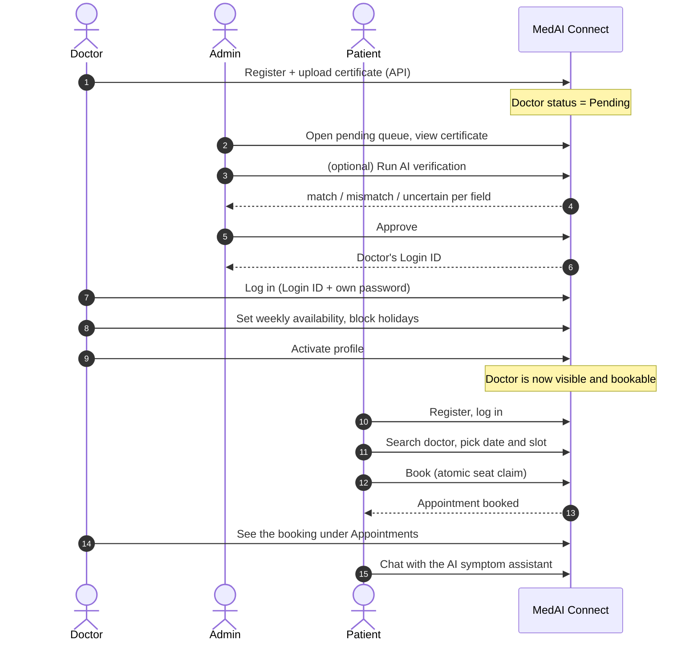

Document Name : End-to-End Walkthrough
Version       : 1.0
Author        : Souradeep Misra
Status        : Living document
Created Date  : 20 September 2026
Last Updated  : 20 September 2026

# End-to-End Walkthrough

One complete pass through the product, across all three roles, in the order things have to happen. Assumes the stack is running and the admin is seeded ([Setup & Run Guide](06-Setup-and-Run-Guide.md)).

## The flow at a glance



A doctor appears on the patient site only when they are **Approved by an admin *and* Activated by themselves**. Before either step, they are invisible and unbookable.

---

## Part 1: Using the web UI

### Step 1: Doctor registers *(API only for now)*

There is no doctor registration form in the UI yet, so this one step uses the API (any JPG or PNG works as the "certificate"):

```bash
curl -X POST http://localhost:5000/api/doctors/register \
  -F "name=Sarah Chen" \
  -F "registrationNumber=MC-2024-001" \
  -F "degree=MBBS, MD" \
  -F "specialization=Cardiology" \
  -F "experience=9" \
  -F "password=DoctorPass123" \
  -F "document=@./certificate.jpg;type=image/jpeg"
```

Expect `201` and `"verificationStatus":"Pending"`. The doctor chose their own password here; approval does not replace it.

### Step 2: Admin reviews and approves

1. Open http://localhost:5173/admin/login and sign in as `admin@medai.com` / `ChangeThisPassword123`.
2. The **Pending Doctor Verifications** queue lists the doctor with an *AI check: NotRun* badge. Open them.
3. The review page shows the submitted profile next to the **uploaded certificate**.
4. *(Optional, needs an OpenAI key)* Click **Run AI Verification**. You get a match / mismatch / uncertain badge for name, registration number and degree, what the model actually read from the document, any concerns, and a summary. Without a key you'll see a red `401 Incorrect API key` message, which is the designed failure state. You can still decide without it.
5. Click **Approve**. A green callout shows the doctor's **Login ID** (like `DOC-1A2B3C`). **Copy it**: it is how the doctor logs in. (A temporary password appears here only in the rare case a doctor has no password of their own.)
   *Reject* keeps the record but marks it Rejected.

### Step 3: Doctor sets up and activates

1. Open http://localhost:5173/doctor/login, enter the Login ID and the password from step 1.
2. The dashboard shows the profile and **Activation Status**. The **Activate** button is disabled and asks for availability first.
3. Go to **Availability**. Tick the days the doctor works, set start/end times, choose **Slot duration** (minutes) and **Max patients per slot**, and click **Save Availability**.
4. Optionally pick a date under **Blocked Dates** and click **Block this date**. No slots will be offered that day.
5. Back on the **Dashboard**, click **Activate**. The badge turns green: *Activated, patients can book appointments with you*.

### Step 4: Patient finds and books

1. Open http://localhost:5173/register, create an account (name, email, phone, password, re-enter password), then log in at `/login`.
2. On **Find a Doctor**, the new doctor now appears. Try the name search and the specialization filter.
3. Open the doctor. Pick a date (today through 30 days ahead). Slots that already passed today, blocked dates and non-working days show no slots; full slots are greyed out.
4. Click a slot, keep or change the **Booking Amount** (must be at least `MIN_BOOKING_AMOUNT`, default 100), and click **Confirm Booking**. You'll see *Appointment booked!*
5. **My Appointments** lists it with doctor, date, time, amount and a *Booked* badge.

### Step 5: Both sides see the booking

- As the doctor, open **Appointments**: the patient's name, date/time and contact number are there.
- As the patient, open **AI Symptom Chat**, describe a symptom, and read the reply. Try something alarming like "chest pain and trouble breathing": the assistant is instructed to tell you to seek emergency care immediately. Reload the page and the conversation is still there.

### Things worth trying (edge cases the system handles)

| Try this | Expect |
|---|---|
| Book with an amount below the minimum, or non-numeric | `A minimum booking amount of 100 is required`, and no seat is consumed |
| Book a slot that's full (set *Max patients per slot* to 1 and book it twice) | `This slot is fully booked` |
| Two browsers click the last seat at the same instant | exactly one succeeds, the other gets the "fully booked" message |
| Open `/admin` while logged out | redirected to `/admin/login` |
| Use a patient token on a doctor/admin API | `403 You do not have permission` |
| Send a chat message with an invalid OpenAI key | clean inline error; nothing is saved to the history |

---

## Part 2: The same flow through the API

Handy for scripting or when you want to see exactly what the UI sends. Replace `<...>` with values from earlier responses. Full details for every endpoint: [API Reference](05-API-Reference.md).

Pick a date to test with. Use **tomorrow** so today's already-passed times don't confuse you:

```bash
DATE=$(date -u -d "+1 day" +%F)                # Linux / Git Bash
# PowerShell: $DATE = (Get-Date).ToUniversalTime().AddDays(1).ToString("yyyy-MM-dd")
```

**1. Admin logs in**
```bash
curl -s -X POST http://localhost:5000/api/auth/admin/login \
  -H "Content-Type: application/json" \
  -d '{"email":"admin@medai.com","password":"ChangeThisPassword123"}'
# -> copy "token"  = <ADMIN_TOKEN>
```

**2. Register the doctor** (see Part 1, step 1), then **list the pending queue**
```bash
curl -s http://localhost:5000/api/admin/doctors/pending -H "Authorization: Bearer <ADMIN_TOKEN>"
# -> copy the doctor's "_id" = <DOCTOR_ID>
```

**3. (Optional) run the AI check, then approve**
```bash
curl -s -X POST http://localhost:5000/api/admin/doctors/<DOCTOR_ID>/verify-document -H "Authorization: Bearer <ADMIN_TOKEN>"
curl -s -X PATCH http://localhost:5000/api/admin/doctors/<DOCTOR_ID>/approve -H "Authorization: Bearer <ADMIN_TOKEN>"
# -> copy "doctor.loginId"  = <LOGIN_ID>
```

**4. Doctor logs in, sets availability (all 7 days, 09:00-17:00, 30-minute slots, 2 patients each), activates**
```bash
curl -s -X POST http://localhost:5000/api/auth/doctor/login \
  -H "Content-Type: application/json" \
  -d '{"loginId":"<LOGIN_ID>","password":"DoctorPass123"}'
# -> copy "token"  = <DOCTOR_TOKEN>

curl -s -X POST http://localhost:5000/api/doctor/availability \
  -H "Authorization: Bearer <DOCTOR_TOKEN>" -H "Content-Type: application/json" \
  -d '{"weeklySchedule":[
        {"dayOfWeek":0,"startTime":"09:00","endTime":"17:00"},
        {"dayOfWeek":1,"startTime":"09:00","endTime":"17:00"},
        {"dayOfWeek":2,"startTime":"09:00","endTime":"17:00"},
        {"dayOfWeek":3,"startTime":"09:00","endTime":"17:00"},
        {"dayOfWeek":4,"startTime":"09:00","endTime":"17:00"},
        {"dayOfWeek":5,"startTime":"09:00","endTime":"17:00"},
        {"dayOfWeek":6,"startTime":"09:00","endTime":"17:00"}],
       "slotDurationMinutes":30,"maxPatientsPerSlot":2}'

curl -s -X PATCH http://localhost:5000/api/doctor/activate -H "Authorization: Bearer <DOCTOR_TOKEN>"
```

**5. Patient registers, logs in, finds the doctor and their slots**
```bash
curl -s -X POST http://localhost:5000/api/patients/register \
  -H "Content-Type: application/json" \
  -d '{"name":"Test Patient","email":"patient@example.com","phone":"9876543210","password":"PatientPass123"}'

curl -s -X POST http://localhost:5000/api/auth/patient/login \
  -H "Content-Type: application/json" \
  -d '{"identifier":"patient@example.com","password":"PatientPass123"}'
# -> copy "token"  = <PATIENT_TOKEN>

curl -s "http://localhost:5000/api/doctors?search=Sarah"
curl -s "http://localhost:5000/api/appointments/slots?doctorId=<DOCTOR_ID>&date=$DATE"
```

**6. Book, then see it from both sides**
```bash
curl -s -X POST http://localhost:5000/api/appointments/book \
  -H "Authorization: Bearer <PATIENT_TOKEN>" -H "Content-Type: application/json" \
  -d "{\"doctorId\":\"<DOCTOR_ID>\",\"date\":\"$DATE\",\"time\":\"09:00\",\"amount\":150}"

curl -s http://localhost:5000/api/appointments/my   -H "Authorization: Bearer <PATIENT_TOKEN>"
curl -s http://localhost:5000/api/doctor/appointments -H "Authorization: Bearer <DOCTOR_TOKEN>"
```

**7. Talk to the AI assistant** *(needs an OpenAI key)*
```bash
curl -s -X POST http://localhost:5000/api/chat/message \
  -H "Authorization: Bearer <PATIENT_TOKEN>" -H "Content-Type: application/json" \
  -d '{"message":"I have had a mild headache since this morning. What should I do?"}'
curl -s http://localhost:5000/api/chat/history -H "Authorization: Bearer <PATIENT_TOKEN>"
```

## Clean up after a demo

```bash
docker compose exec mongodb mongosh medai-connect --eval 'db.doctors.deleteMany({}); db.patients.deleteMany({}); db.appointments.deleteMany({}); db.slots.deleteMany({}); db.doctoravailabilities.deleteMany({}); db.chatlogs.deleteMany({})'
```

This keeps the admin. Uploaded certificates stay in `backend/uploads/doctor-documents/`; delete those files by hand if you want them gone.
